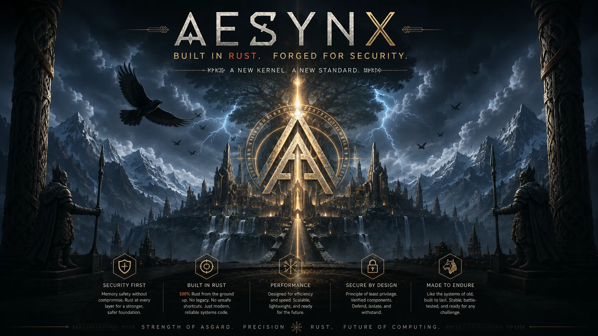

<p align="center">
  <b>A clean-slate Rust operating system built around capabilities, objects, and native services.</b><br>
  Not Unix in new clothes. Not Windows rewritten. A fresh standalone OS path, built carefully from the first boot.
</p>

<div align="center">
  <a href="docs/IMPLEMENTATION_PLAN.md">Implementation Plan</a>
  |
  <a href="docs/RELEASE_PLAN.md">Release Plan</a>
  |
  <a href="docs/security-controls.md">Security Controls</a>
  |
  <a href="SECURITY.md">Security</a>
</div>

<br>

<p align="center">
  
</p>

# Aesynx

Aesynx is a Rust `no_std` operating-system project with a clean-slate goal: a
standalone OS that does not begin by copying Unix, Linux, or Windows. Its native
model is built around explicit capabilities, per-core ownership, service queues,
driver isolation, an immutable object graph, structured userspace, and AI-ready
telemetry from day one.

The long-term goal is a different kind of general-purpose system, not a compatibility
skin over old assumptions. Paths, processes, packages, drivers, snapshots, and
automation should be native Aesynx concepts first. Unix or Linux compatibility
can exist later as an isolated service, but it must not define the kernel,
userspace, or security model.

Aesynx is also explicitly not planned as one huge OS binary: components should
remain separately identified, signed, versioned, updateable, and
rollback-capable.

The first major milestone is a serious x86_64 QEMU release with a coherent
security model, clear non-claims, and release gates that block tagging until
checks and pentest evidence are complete. The project is early, but the direction
is intentionally standalone.

Aesynx is licensed under the European Union Public Licence 1.2.

## What Works Today

`v0.15.0` is the current page-table-mapper implementation candidate. It builds a
release-profile freestanding `x86_64-unknown-none` kernel ELF, packages it into
a Limine ISO, records build and boot tool versions in the image manifest, boots
it in QEMU, normalizes Limine handoff metadata into Aesynx `BootInfo`, verifies
kernel-owned serial markers, installs basic x86_64 descriptor and interrupt
tables, remaps and masks the legacy PIC, detects whether the local APIC is present,
publishes checked IRQ vector allocation, handles a returning breakpoint
exception, and can run opt-in deliberate panic and page-fault smoke tests with
redacted CR2 presence/page-offset, CR3 low-bit, RFLAGS, interrupt-state, and
decoded page-fault diagnostics. Normal boot now emits a checked physical memory
report with total, usable, reserved, kernel, bootloader, framebuffer, ACPI, bad,
and frame-count accounting before `[TEST] memory-map=ok`, then initializes a
bounded early bitmap frame allocator from a usable boot-map window and verifies
one-frame allocation/free, contiguous allocation/free, debug state, and
double-free detection before `[TEST] frame-allocator=ok`, then exercises a
bounded x86_64-shaped page-table mapper model with map, contiguous range
map/protect/unmap, permission lookup, contiguous range lookup, permission
change, unmapped range checks, read-only mapping visit, virtual range permission
verification, page-presence checks, mapped-range checks, kernel-only policy
checks, kernel-range policy checks, write-protected range checks,
non-executable range checks, no-executable address-space policy checks,
no-writable address-space policy checks, no-device address-space policy checks,
no-global address-space policy checks, redacted mapping summaries, translate,
unmap, consistency audit, empty-table reclamation, and explicit TLB flush
targets before `[TEST] page-table=ok`. The opt-in timer smoke
path installs a checked IRQ0 handler, programs the legacy PIT for QEMU, observes
three controlled timer ticks, converts ticks into monotonic nanosecond values,
wakes a bounded sleep request for a delayed log event, acknowledges each
interrupt, and then disables the smoke IRQ.

| Area | Status | Notes |
| --- | --- | --- |
| Rust workspace | Active | Modular crate layout with no root `src/` implementation pile. |
| Toolchain | Active | Stable Rust `1.96.0`, edition 2024, resolver `3`, and `x86_64-unknown-none` for the first boot ELF. |
| Kernel crate policy | Active | Crates under `crates/` must be `no_std`, deny unsafe by default, and avoid external dependencies without exceptions. |
| Capability model | Model active | Private non-copy authority values, permission validation, audited derive/grant paths, generation/epoch validation, and revoke authority checks. |
| Memory model | Model active | Page flags make writable+executable and user-global mappings unrepresentable; long-term memory should become object-native, purpose-tagged, capability-scoped, and snapshot-aware. |
| OS world model | Planned | Kernel-stamped facts should feed a native world service so Aesynx can explain boot, memory, packages, drivers, capabilities, snapshots, and policy decisions without putting a database in ring 0. |
| IPC model | Model active | Kernel-stamped message headers, caller requests, and bounded inline payloads. |
| Bytecode model | Model active | Fuel limit and capability-typed permission checks. |
| Logging model | Model active | Bounded single-record log messages. |
| Build path | Active | x86_64 target metadata, linker script, Cargo config validation, stable freestanding kernel ELF build, and an optional nightly custom-target probe. |
| QEMU first boot | Active | `cargo xtask image` creates a release-profile Limine ISO and `cargo xtask qemu` verifies `[TEST] irq=ok`, `[TEST] exception=ok`, `[TEST] memory-map=ok`, `[TEST] frame-allocator=ok`, `[TEST] page-table=ok`, `[TEST] bootinfo=ok`, and `[TEST] boot=ok` from Rust `_start`. |
| BootInfo normalization | Tagged | Limine memory map, executable address, HHDM, RSDP, and framebuffer metadata normalize into dependency-free `aesynx-boot` structures. |
| Early diagnostics | Tagged | Boot phase tracking and `cargo xtask qemu --panic-smoke` verify readable panic output with `[TEST] panic=ok`. |
| GDT and TSS | Tagged | Early x86_64 boot installs an Aesynx-owned GDT, TSS, and double-fault IST stack, verified with `[TEST] gdt=ok`. |
| IDT and exceptions | Tagged | Early x86_64 boot installs an IDT, handles breakpoint, page-fault, and double-fault vectors, and verifies `[TEST] exception=ok`. |
| Fault decoding | Tagged | `v0.9.0`; page-fault smoke prints redacted CR2 presence/page offset, CR3 low bits, public RFLAGS, interrupt state, and decoded error bits. |
| Interrupt controller baseline | Tagged | `v0.10.0`; remaps/masks legacy PIC IRQs, detects local APIC presence, defines checked IRQ vectors, and exposes an EOI path. |
| Timer ticks | Tagged | `v0.11.0`; opt-in QEMU timer smoke programs PIT IRQ0, records a tick counter, and verifies `timer tick 1..3` plus `[TEST] timer=ok`. |
| Monotonic time and sleeps | Tagged | `v0.12.0`; converts timer ticks into monotonic instants, schedules a bounded sleep request, and verifies `timer delayed-log`, `[TEST] sleep=ok`, and `[TEST] timer=ok`. |
| Physical memory map | Tagged | `v0.13.0`; rejects invalid/overlapping regions and reports checked total/usable/reserved bytes, frame counts, and kernel/bootloader reserved accounting with `[TEST] memory-map=ok`. |
| Bitmap frame allocator | Tagged | `v0.14.0`; safe `aesynx-mm` bitmap allocator model plus QEMU smoke for bounded early alloc/free, contiguous allocation, debug states, double-free detection, and atomic failure behavior with `[TEST] frame-allocator=ok`. |
| Page table mapper | Active candidate | `v0.15.0`; safe bounded `aesynx-mm` page-table mapper model with x86_64-shaped tables, map/unmap/translate, contiguous range map/protect/unmap plus lookup, upfront range validation, bounded range walks, unmapped range checks, mapped-range checks, page-presence checks, kernel-only policy checks, no-executable policy checks, no-writable policy checks, no-device policy checks, no-global policy checks, kernel-range policy checks, write-protected range checks, non-executable range checks, read-only mapping visit, redacted mapping summaries, virtual range permission verification, permission lookup/change, consistency audit, empty-table reclamation, explicit TLB flush targets, and QEMU smoke with `[TEST] page-table=ok`. |
| Native snapshots | Planned | Content-addressed object roots make snapshots and rollback object-layer primitives rather than path-first filesystem features. |
| Native package manager | Planned | Content-addressed package objects, declarative generations, explicit tracks, SBOM/provenance, and capability manifests. |
| Future bootloader | Planned | Limine is current; a future Rust UEFI bootloader should be a minimal security gateway for signed/measured Aesynx boot capsules. |
| Post-quantum readiness | Planned | Crypto-agile boot, package, update, and identity metadata with room for hybrid classical plus post-quantum validation. |
| Supply-chain checks | Active | `cargo deny`, `cargo audit`, SBOM generation, Dependabot, SHA-pinned GitHub Actions, and CodeQL default Rust workflow. |
| Release gate | Active | Tags require local checks, SBOM, CodeQL on GitHub, and a passing pentest report for the exact commit. |

## Planned Next

| Area | Status | Target |
| --- | --- | --- |
| Kernel mapping policy | Planned | `v0.16.0`; apply real kernel text/rodata/data/stack/direct-map permission policy. |
| Real arch mechanisms | Planned | Core identity, timestamp, production page tables, and CPU setup. |
| Capability services | Planned | Concrete revocation epoch store, audit backend, object registry, and authenticated call paths. |
| Native userspace | Planned | `aesh`, structured pipelines, WASM components, and capability-scoped command execution. |
| OS world service | Planned | Signed/versioned facts, branchable worlds, policy-aware queries, context packs, and AI-safe explanations over deterministic OS evidence. |
| Package manager | Planned | `aepkg`/`aepkgd` roadmap for search, install, update, rollback, repair, and future store UI. |
| Post-quantum readiness | Planned | Crypto-agile signature envelopes and trust policy before signed boot capsules, package registries, or update metadata. |

## Local Checks

Run the full repository gate:

```bash
scripts/checks.sh
```

Generate the source SBOM:

```bash
scripts/generate-sbom.sh
```

Validate the current kernel build path:

```bash
cargo xtask build-kernel
```

Create and smoke-test the v0.15 Limine QEMU image:

```bash
cargo xtask image
cargo xtask qemu
```

Run the deliberate panic diagnostics smoke:

```bash
cargo xtask qemu --panic-smoke
```

Run the deliberate exception smoke:

```bash
cargo xtask qemu --exception-smoke
```

Run the controlled timer smoke:

```bash
cargo xtask qemu --timer-smoke
```

These commands require Limine 12.3.2 or newer, xorriso, and
`qemu-system-x86_64`. The generated manifest records the exact Rust, Limine,
xorriso, and QEMU version banners.

Try the documented custom-target experiment when a nightly toolchain is
available:

```bash
cargo xtask build-kernel --custom-target-probe
```

After a pentest report is completed for a tag:

```bash
cargo xtask release-ready v0.15.0
```

## Security Posture

Aesynx treats boot, memory, capabilities, IPC, driver authority, userspace ABI,
WASM execution, telemetry, AI policy, build tooling, GitHub workflows, and
dependency metadata as high-risk. The project prefers internal kernel
primitives, narrow unsafe boundaries, no ambient authority, explicit
capabilities, and small modules that can be reviewed and tested.

Every release tag is blocked until the exact commit being tagged has a passing
pentest report in `security/pentest/<tag>.md`.

## Documentation

- [Implementation Plan](docs/IMPLEMENTATION_PLAN.md)
- [Userspace Vision](docs/userspace-vision.md)
- [Memory Model Roadmap](docs/memory-model-roadmap.md)
- [OS World Roadmap](docs/os-world-roadmap.md)
- [Package Manager Roadmap](docs/package-manager-roadmap.md)
- [Driver Roadmap](docs/driver-roadmap.md)
- [Release Plan](docs/RELEASE_PLAN.md)
- [Architecture Decisions](docs/ARCHITECTURE_DECISIONS.md)
- [Build Skeleton](docs/build-skeleton.md)
- [QEMU Image Skeleton](docs/qemu-image-skeleton.md)
- [First Serial Boot](docs/first-serial-boot.md)
- [BootInfo Normalization](docs/bootinfo-normalization.md)
- [Early Diagnostics](docs/early-diagnostics.md)
- [v0.7.0 Release Candidate Notes](docs/releases/v0.7.0-rc.md)
- [v0.8.0 Release Candidate Notes](docs/releases/v0.8.0-rc.md)
- [v0.9.0 Release Candidate Notes](docs/releases/v0.9.0-rc.md)
- [v0.10.0 Release Candidate Notes](docs/releases/v0.10.0-rc.md)
- [v0.11.0 Release Candidate Notes](docs/releases/v0.11.0-rc.md)
- [v0.12.0 Release Candidate Notes](docs/releases/v0.12.0-rc.md)
- [v0.13.0 Release Candidate Notes](docs/releases/v0.13.0-rc.md)
- [v0.14.0 Release Candidate Notes](docs/releases/v0.14.0-rc.md)
- [v0.15.0 Release Candidate Notes](docs/releases/v0.15.0-rc.md)
- [Bootloader Roadmap](docs/bootloader-roadmap.md)
- [Storage Roadmap](docs/storage-roadmap.md)
- [Hosted Execution Roadmap](docs/hosted-execution-roadmap.md)
- [Post-Quantum Readiness](docs/post-quantum-readiness.md)
- [Security Policy](SECURITY.md)
- [Threat Model](docs/threat-model.md)
- [Security Controls](docs/security-controls.md)
- [Supply-Chain Security](docs/supply-chain-security.md)
- [Kernel Engineering Policy](docs/kernel-engineering-policy.md)
- [Unsafe Policy](docs/unsafe-policy.md)
- [Modularity Policy](docs/modularity-policy.md)
- [Licensing Notes](docs/licensing.md)
- [License](LICENSE)
- [Initial Idea](docs/initial-idea.md)
